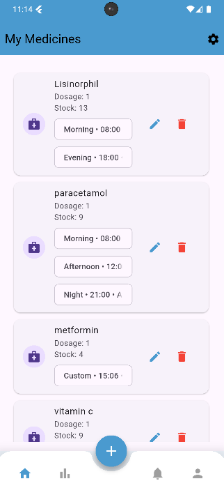
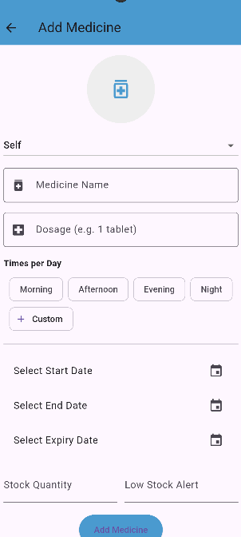
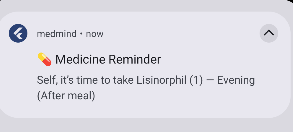
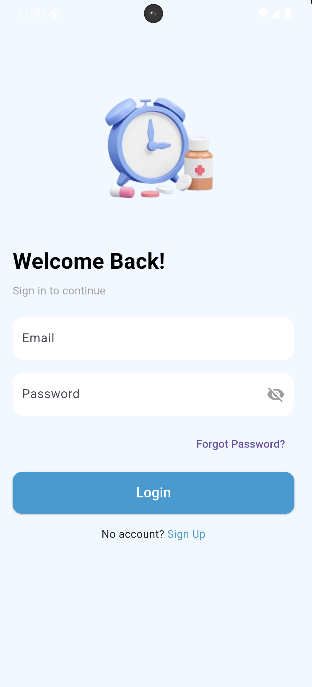

# 💊 MedMind – Medicine Reminder App

MedMind is a **Flutter + Firebase-based mobile application** designed to help users manage their medication schedules efficiently. It ensures users never miss a dose by sending timely reminders and maintaining a clean medicine tracking system.

---

## 🚀 Features

- 📅 Add and manage medicine schedules
- ⏰ Set daily reminders for medicines
- 🔔 Local notification support for alerts
- 📝 Store medicine details (name, dosage, timing, frequency)
- 🔎 Medicine name autocomplete (enhanced UX feature)
- ☁️ Cloud storage using Firebase Firestore
- 🔐 Firebase Authentication (if enabled)
- 📊 Simple and user-friendly UI

---

## 🛠️ Tech Stack

- **Frontend:** Flutter (Dart)
- **Backend:** Firebase
- **Database:** Cloud Firestore
- **Authentication:** Firebase Auth
- **Notifications:** Flutter Local Notifications
- **State Management:** Provider & SetState 
- **Version Control:** Git & GitHub

---

## 📱 App Screens 

### Home Screen 

### Reminder Alert 

 

### Reminder Alert 

 

### Login  

 

## Developed By

Ayisha Nishana KK  
 
